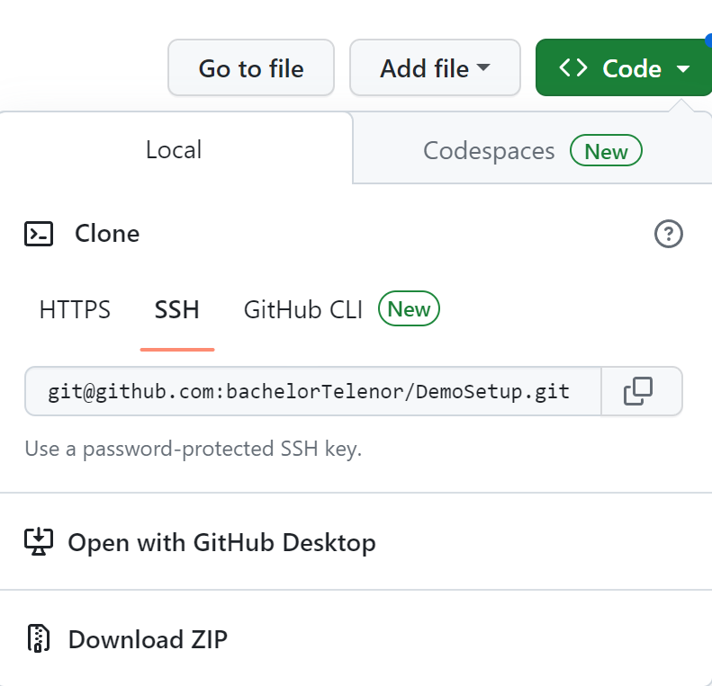

# Elasticsearch demo setup

## Prerequisites
Prerequisites for this demo

### Python
https://www.python.org/

Check if installed by running:
```sh
python --version
```
### Docker Compose
https://docs.docker.com/compose/install/

Check if installed by running:
```sh
docker compose version
```

## Installation
### Get the installation files from Github
https://github.com/bachelorTelenor/DemoSetup



Go to the GitHub page and press the green button at the top of the page that says ```Code```. Press ```Download ZIP``` to get a ZIP file container all the files. Extract the all the files in the ZIP to a folder called ```DemoSetup```.

Open a command line interface like Terminal, CMD or PowerShell. Navigate to the ```DemoSetup``` directory. All commands in this guide will be run from this location. 

### Increase the virtual memory limit

**Windows**
```sh
wsl -d docker-desktop
sysctl -w vm.max_map_count=262144
exit
```

**Linux**
```sh
sysctl -w vm.max_map_count=262144
```

### Start docker containers
Start the docker container by running:
```docker
docker-compose up -d
```
The container will start and begin setting up Elasticsearch and Kibana. This might take a few minutes. You can check if the containers is running with:
```docker
docker ps
```
This should show two containers running. They should be called ```demosetup-kibana-1``` and ```demosetup-es01-1```. 

### Install Python libraries

Install the required libraries by running: 
```py
pip install -r requirements.txt
```

### Check if Elasticsearch and Kibana is working
Make sure Elasticsearch and Kibana is done with the setup before continuing. Go to http://localhost:5601/. If you get the login screen, you can continue. 

### Get Elasticsearch certificate
Get the http certificate from the Elasticsearch container by running:
```docker
docker cp demosetup-es01-1:/usr/share/elasticsearch/config/certs/ca/ca.crt .
```
If the container is not called ```demosetup-es01-1``` run ```docker ps``` and use the name of your Elasticsearch container instead.

### Run the setup script
```py
python Setup.py
```

### Log in to Kibana and navigate to the dashboard
Go to http://localhost:5601/ and log in with:

User: ``elastic``

Pass: ``demodemo``

Navigate to the dashboard uning the hamburger menu in the top left. Click ``Dashboard`` under ``Analytics``. Click the dashboard called ``All Tests``.

### Stop docker containers
To stop the docker containers run:
```docker
docker compose down
```
If you want to remove the volumes and images used by the container, run this instead:
```docker
docker compose down -v --rmi all
```